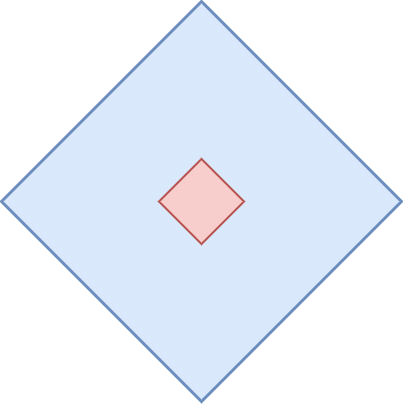
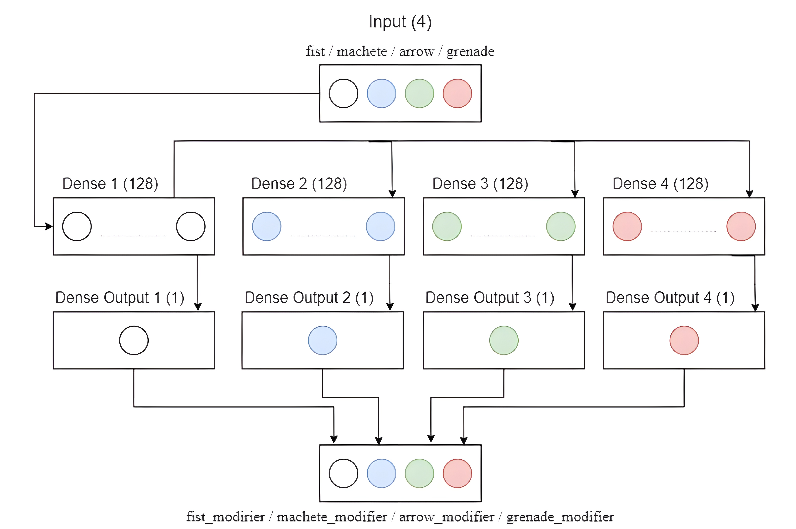
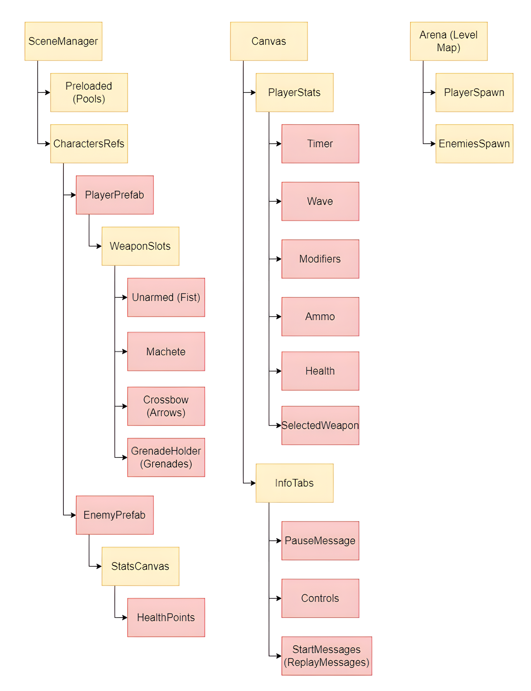
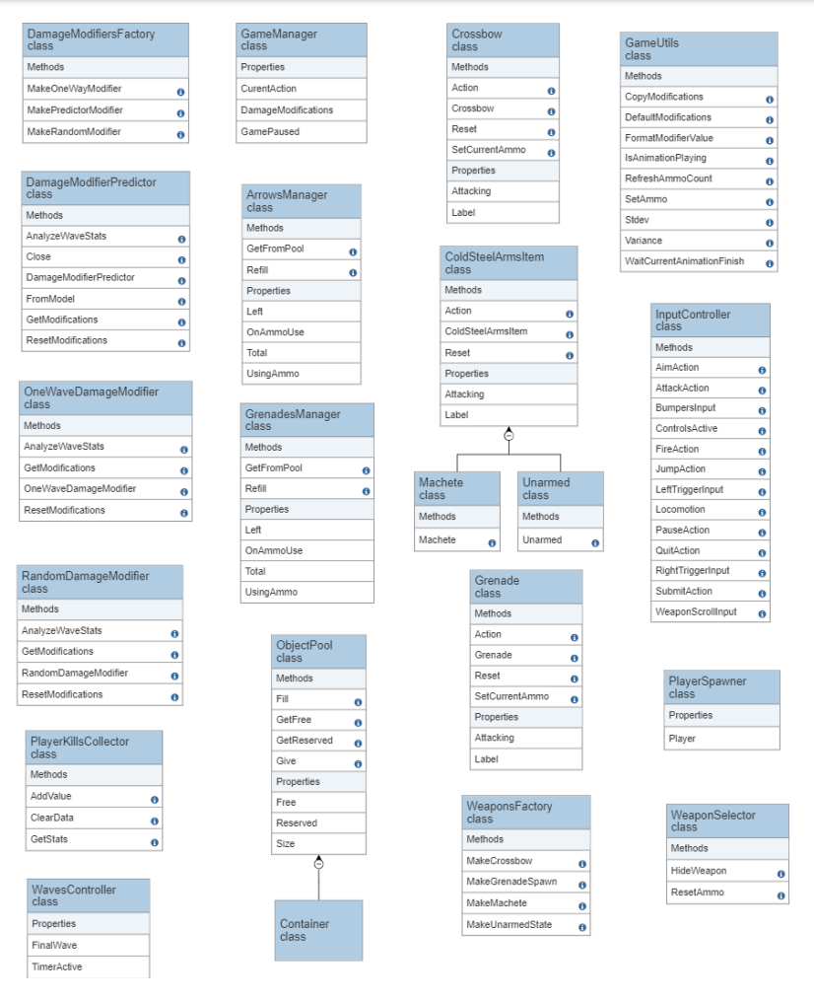
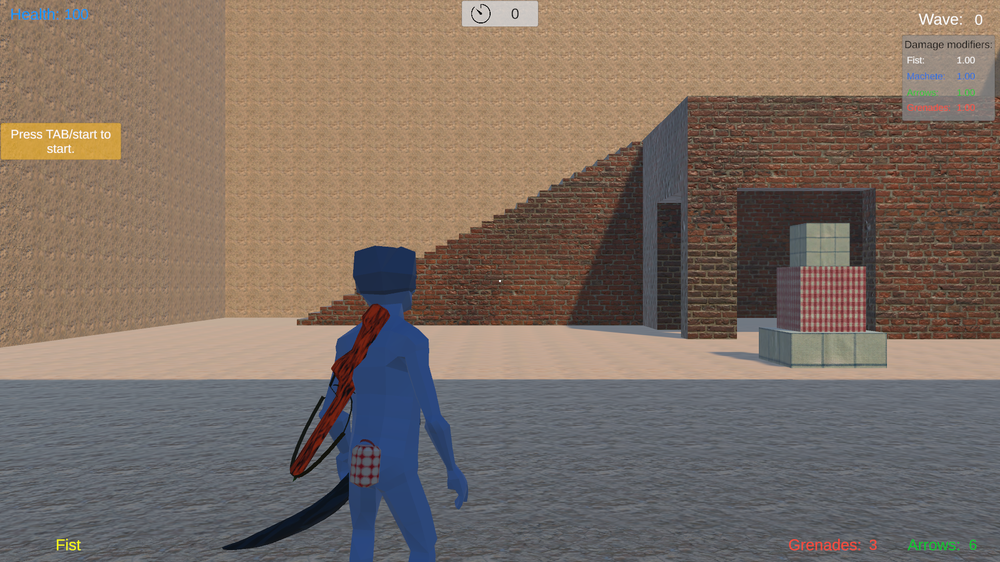
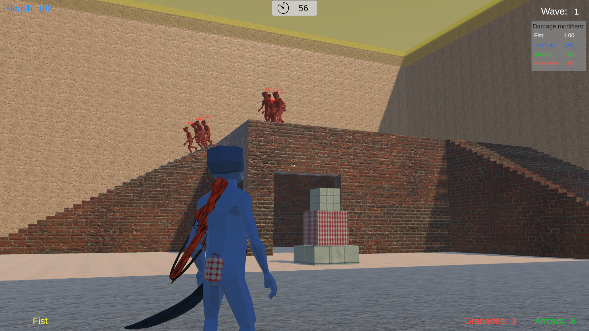
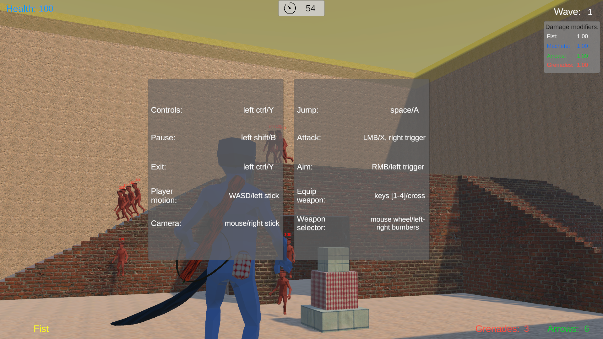
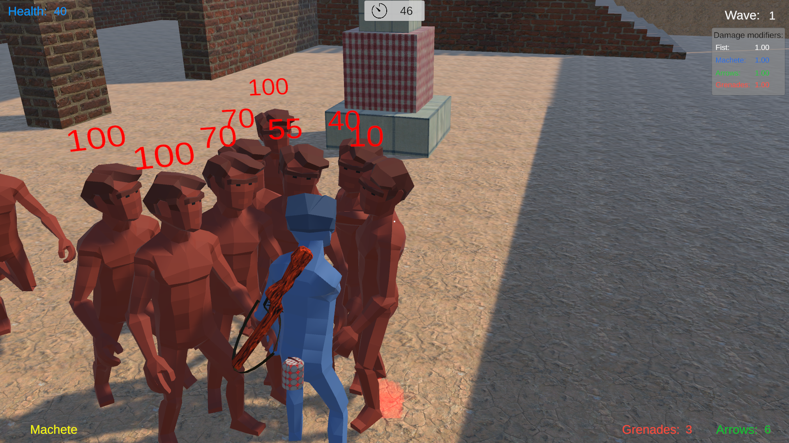
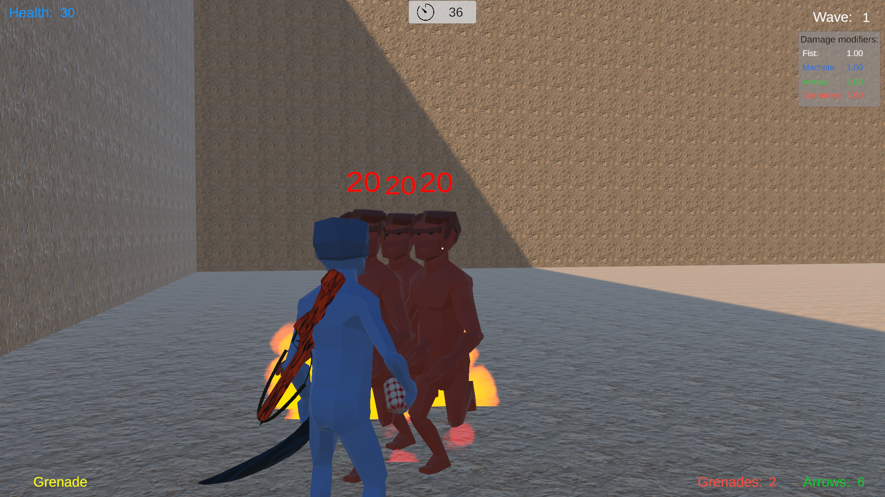
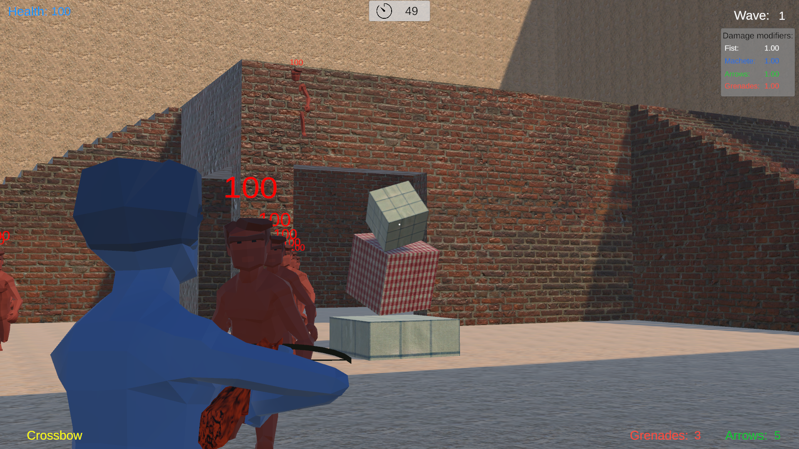

# Reactivation

  

## Description

A third-person shooter made with Unity. The game collects player's metrics (during gameplay) to affect on weapon damage modifiers based on their play style, strategy (activity of usage). The project uses **Barracuda** module to load a runtime model of ONNX format to operate input/output data (gather and predict values). It is a practical part of the **[bachelor's work](https://ela.kpi.ua/items/f57022f0-be84-4b3d-aa0e-f38f550e1ee1)**.

Neural network model architecture (**[here's](/NeuralNetwork/damage_modifiers.ipynb)** a Python notebook):

Scene objects nesting structure on the main map (level):

Class diagram for main clases in the project:

## Gameplay

