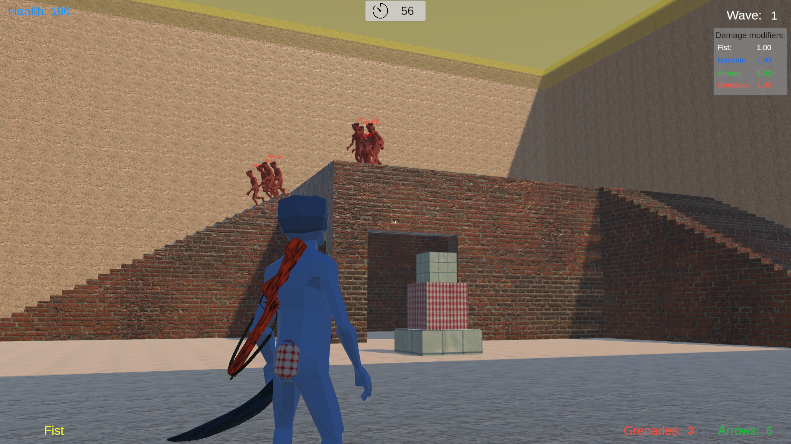
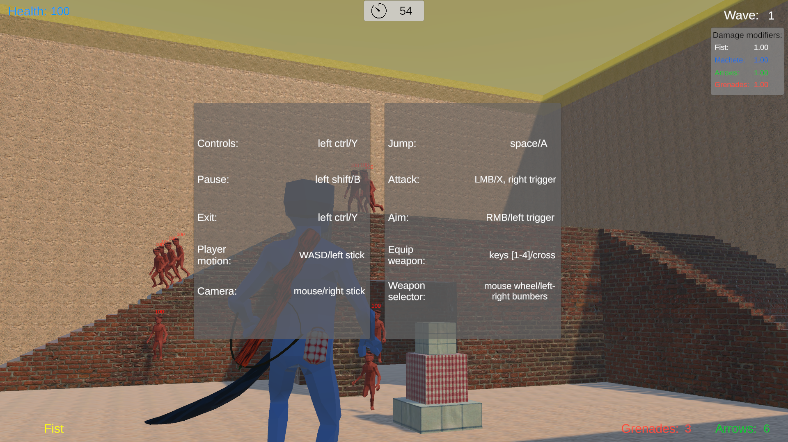
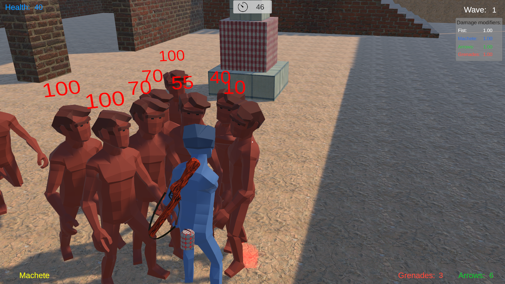
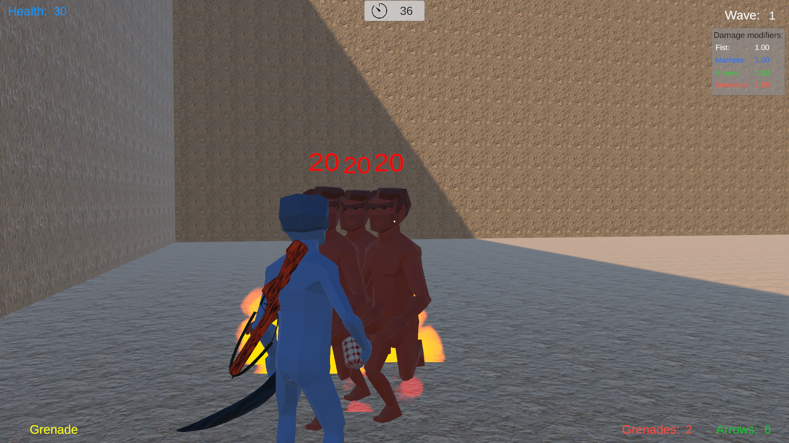
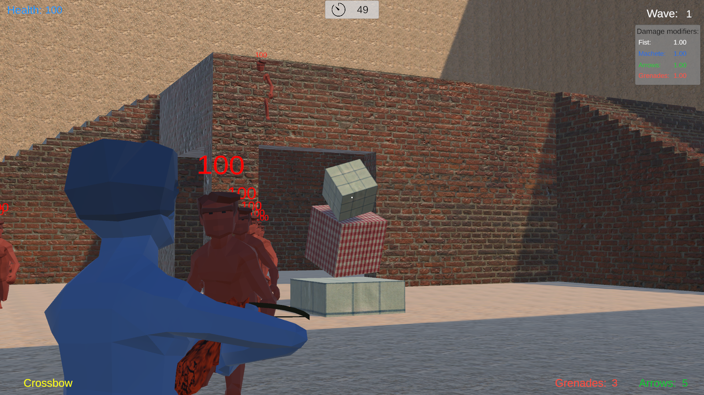

# Reactivation

A third-person shooter made with Unity. The game collects player's metrics (during gameplay) to affect on weapon damage modifiers based on their play style, strategy (activity of usage). The project uses **Barracuda** module to load a runtime model of ONNX format to operate input/output data (gather and predict values).

## Gameplay

